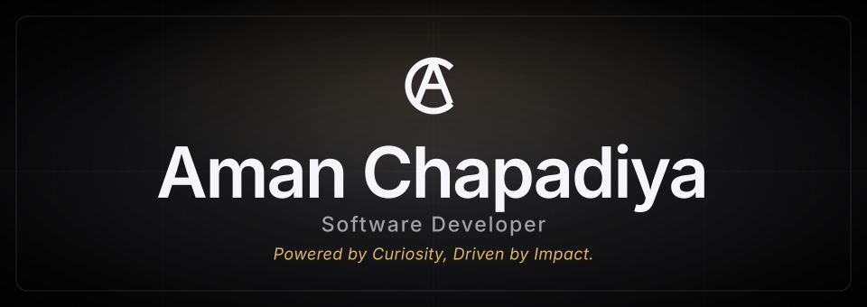
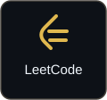

  

  

---

## 👨‍💻 About Me

<table>
<tr>

<td width="62%" valign="middle">

### Hi, I'm Aman 👋

I'm a **Software Developer** focused on **full-stack development, backend engineering, cloud computing, and practical software systems**.

I enjoy working across the complete development lifecycle — from designing responsive interfaces and building APIs to database architecture, deployment, and cloud infrastructure.

### Currently Focused On

- 🌐 **Full-Stack Development**
- ⚙️ **Backend Engineering & REST APIs**
- ☁️ **Cloud Computing**
- 🗄️ **PostgreSQL & MySQL**
- 🧩 **Data Structures & Algorithms**
- 🧠 **AI-powered Applications**

</td>

<td width="38%" align="center" valign="middle">

</td>

</tr>
</table>

---

## 🧑‍💼 Experience & Leadership

<table>
<tr>

<td width="50%" valign="top">

### 🚀 Chief Operating Officer — COO

**eOzka**

Technology startup leadership with a focus on **operations, coordination, and execution**.

</td>

<td width="50%" valign="top">

### 💼 Web Development Intern

**VaultOfCodes · Jun 2026 – Jul 2026**

- Developed and enhanced responsive web applications.
- Worked across frontend and backend development.
- Built reusable components and integrated APIs.
- Contributed to debugging, testing, and feature development.
- Followed structured software development practices.

</td>

</tr>

<tr>

<td width="50%" valign="top">

### 🧑‍💻 Manager

**GeekRoom, KRMU · Jul 2026 – Present**

- Manage technical community activities and student-led initiatives.
- Coordinate events and development-focused programs.
- Manage communication and execution workflows.
- Support planning and delivery of technical activities.

</td>

<td width="50%" valign="top">

### ☁️ General Secretary

**Centre of Excellence — Cloud Computing**

**K.R. Mangalam University · Jan 2026 – Present**

- Coordinate cloud-focused technical initiatives.
- Facilitate peer learning and student engagement.
- Coordinate technical sessions and organizational activities.
- Support cloud learning initiatives.

</td>

</tr>

<tr>

<td width="50%" valign="top">

### ⚡ Core Team Volunteer

**TechTribe · Sep 2024 – Jun 2026**

- Coordinated technical community initiatives.
- Supported student-focused technology programs.
- Worked with cross-functional teams.
- Supported event planning and structured execution.

</td>

<td width="50%" valign="top">

### 🎯 Leadership Focus

**Technology · Community · Coordination · Execution**

Combining software development with technical community leadership and team coordination.

</td>

</tr>
</table>

---

## 🛠️ Technical Skills

### Languages

  

### Frontend

  

### Backend & APIs

  

### Databases

  

### Cloud & Tools

### Core Concepts

---

## 🚀 Featured Projects

<table width="1100">
<tr>

<td width="550" align="center" valign="top">

</td>

<td width="550" align="center" valign="top">

</td>

</tr>
</table>

 

↗ <b>Click a project card to explore the live application.</b>

---

<table width="100%">
<tr>

<td width="58%" valign="middle" align="center">

### ⚙️ How I Build Software

 

  

<b>Understand the problem → build with intent → validate relentlessly → iterate → ship.</b>

  

I enjoy turning ideas into functional software and continuously improving the engineering behind it.

</td>

<td width="42%" align="center" valign="middle">

</td>

</tr>
</table>

---

## GitHub Analytics

<table width="100%">
<tr>
<td width="50%" valign="middle" align="center">

</td>
<td width="50%" valign="middle" align="center">

</td>
</tr>
</table>

 

<table width="100%">
<tr>
<td align="center">

<picture>
  <source
    media="(prefers-color-scheme: dark)"
    srcset="https://streak-stats.demolab.com/?user=obscure-01&hide_border=false&background=0D1117&ring=00C853&fire=00C853&currStreakNum=F0F6FC&sideNums=F0F6FC&currStreakLabel=00C853&sideLabels=8B949E&dates=8B949E&stroke=30363D&border=30363D"
  />
  <source
    media="(prefers-color-scheme: light)"
    srcset="https://streak-stats.demolab.com/?user=obscure-01&hide_border=false&background=FFFFFF&ring=00A63C&fire=00A63C&currStreakNum=24292F&sideNums=24292F&currStreakLabel=008F72&sideLabels=57606A&dates=57606A&stroke=D0D7DE&border=D0D7DE"
  />
  
</picture>

</td>
</tr>
</table>

---

## Contribution Activity

<picture>
  <source media="(prefers-color-scheme: dark)" srcset="https://raw.githubusercontent.com/obscure-01/obscure-01/output/activity-graph-dark.svg">
  <source media="(prefers-color-scheme: light)" srcset="https://raw.githubusercontent.com/obscure-01/obscure-01/output/activity-graph-light.svg">
  
</picture>

---

## ☁️ Cloud Computing

  

I'm interested in building and deploying applications while strengthening my understanding of <b>cloud infrastructure, deployment, and scalable software systems</b>.

---

## 📚 Currently Learning

---

## 📜 Certifications

<table>
<tr>
<th>Certification</th>
<th>Platform</th>
</tr>

<tr>
<td><b>Microsoft Azure Fundamentals — AZ-900</b></td>
<td>Microsoft</td>
</tr>

<tr>
<td><b>Introduction to AI</b></td>
<td>Coursera</td>
</tr>

<tr>
<td><b>Start Writing Prompts Like a Pro</b></td>
<td>Coursera</td>
</tr>

</table>

---

## 🧠 Engineering Mindset

<table>
<tr>

<td align="center" width="25%">

<h3>🔍 Understand</h3>

Understand the problem before choosing the technology.

</td>

<td align="center" width="25%">

<h3>🏗️ Build</h3>

Turn ideas into clean and functional software.

</td>

<td align="center" width="25%">

<h3>⚡ Improve</h3>

Test, debug, learn, and iterate continuously.

</td>

<td align="center" width="25%">

<h3>🚀 Ship</h3>

Build software that can actually be used.

</td>

</tr>
</table>

---

## 📈 Development Journey

<pre>
                         COMPUTER SCIENCE
                                │
                                ▼
                    Programming Fundamentals
                       JavaScript • Java • Python
                                │
                                ▼
                       Web Development
                    HTML • CSS • React • Next.js
                                │
                                ▼
                     Full-Stack Development
                         Node.js • REST APIs
                                │
                                ▼
                           Databases
                      PostgreSQL • MySQL
                                │
                                ▼
                       Cloud Computing
                         Microsoft Azure
                                │
                                ▼
                        AI Applications
                                │
                                ▼
                   Scalable Software Systems
</pre>

---

## 🎯 2026 Focus

<table>
<tr>
<th>Area</th>
<th>Focus</th>
</tr>

<tr>
<td>🌐 Full-Stack Development</td>
<td>Build stronger end-to-end applications</td>
</tr>

<tr>
<td>⚙️ Backend Engineering</td>
<td>Improve API architecture and database-driven systems</td>
</tr>

<tr>
<td>☁️ Cloud Computing</td>
<td>Strengthen cloud and deployment fundamentals</td>
</tr>

<tr>
<td>🧩 DSA</td>
<td>Improve algorithmic problem solving</td>
</tr>

<tr>
<td>🧠 AI Applications</td>
<td>Explore practical AI integrations in software</td>
</tr>

</table>

---

<strong>LET'S CONNECT</strong>

<h3>Open to ideas, collaboration &amp; building.</h3>

<table>
  <tr>
    <td align="center" width="130">
      
    </td>
    <td align="center" width="130">
      
    </td>
    <td align="center" width="130">
      
    </td>
    <td align="center" width="130">
      
    </td>
  </tr>
</table>

<strong>BUILD · LEARN · IMPROVE · SHIP</strong>

---

 

Made with ♥ in India

